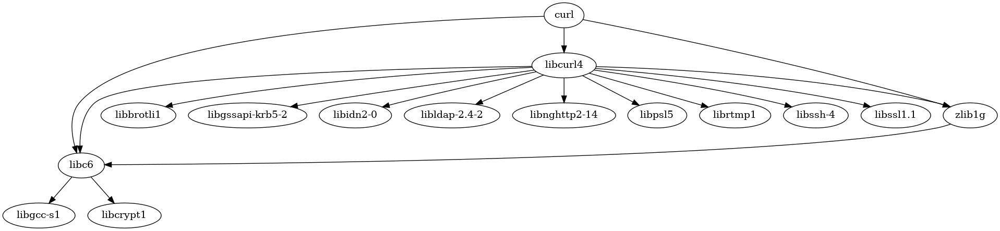

# config_managment_2

# Задача 2

Разработать инструмент командной строки для визуализации графа зависимостей, включая транзитивные зависимости. Сторонние средства для получения зависимостей использовать нельзя.

Зависимости определяются по имени пакета ОС Ubuntu (apt). Для описания графа зависимостей используется представление Graphviz. Визуализатор должен выводить результат на экран в виде кода.

Ключами командной строки задаются:

• Путь к программе для визуализации графов.
• Имя анализируемого пакета.
• Путь к файлу-результату в виде кода.
• Максимальная глубина анализа зависимостей.
• URL-адрес репозитория.

Все функции визуализатора зависимостей должны быть покрыты тестами.

Пример вызова программы в консоли

fds

Пример получившегося графа

## Пример вывода кода графа
